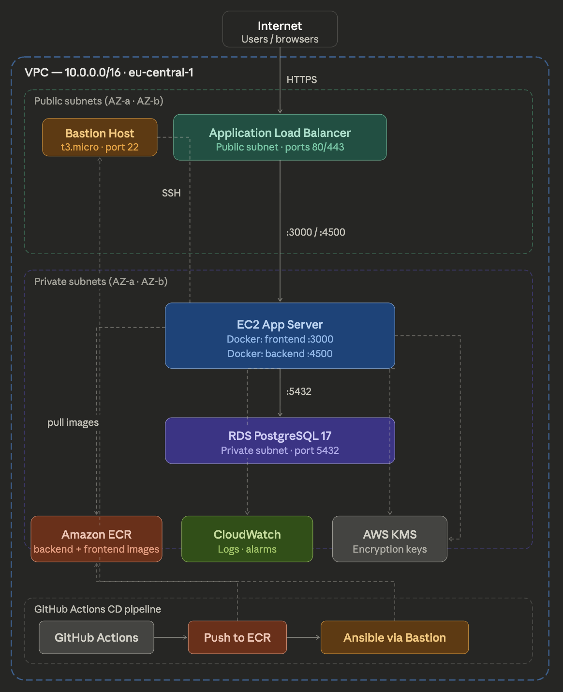
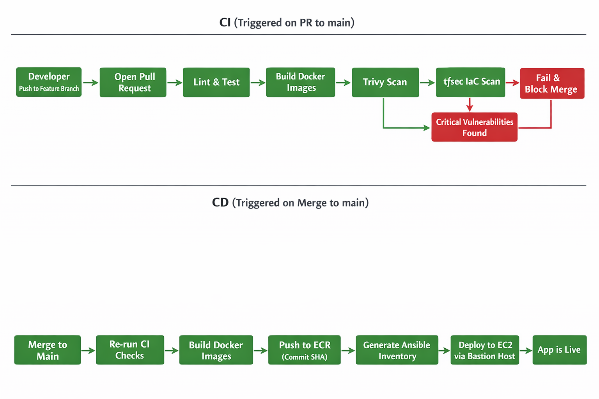

# EduRev Rwanda

> A smart revision companion for Rwandan secondary students preparing for national exams.

<!-- Uncomment when deployed:
**Live Application:** [http://edurev-rwanda-alb-xxxx.eu-central-1.elb.amazonaws.com](http://edurev-rwanda-alb-xxxx.eu-central-1.elb.amazonaws.com)
**Video Demo:** [Link to demo video]()
-->

---

## Table of Contents

- [Team Member Contributions](#team-member-contributions)
- [Overview](#overview)
- [Architecture](#architecture)
- [Technology Stack](#technology-stack)
- [Getting Started](#getting-started)
- [Usage](#usage)
- [Docker Deployment](#docker-deployment)
- [Infrastructure (Terraform)](#infrastructure-terraform)
- [Configuration Management (Ansible)](#configuration-management-ansible)
- [CI/CD Pipelines](#cicd-pipelines)
- [API Reference](#api-reference)
- [Project Structure](#project-structure)
- [Troubleshooting](#troubleshooting)

---

## Team Member Contributions

| Name | Contributions | Role | Contact |
|------|---------------|------|---------|
| Loraine Mukezwa Irakoze | Ansible Configuration, CI Pipelines and Security Scanning, Docker Compose Revision | Team Lead | l.irakoze2@alustudent.com |
| Ninette Irisa Agatesi | Terraform Scripting, gitignore Optimization | Backend Developer | n.agatesi@alustudent.com |
| John Kwizera | Dockerization & Infrastructure Provisioning | DevOps Engineer | j.kwizera@alustudent.com |
| Nicole Ange Mukundwa | CD Pipeline, Migration from MongoDB to PostgreSQL | Frontend Developer | n.mukundwa@alustudent.com |

## Overview

EduRev Rwanda is a web application designed to help Rwandan secondary students efficiently revise for their national exams. The platform offers randomized practice questions based on the REB (Rwanda Education Board) curriculum, allowing students to test their knowledge and identify areas for improvement. Additionally, EduRev offers forums where students can discuss topics, share resources, and support each other in their revision journey. EduRev aims to create a collaborative learning environment that fosters academic success and builds a strong community of learners.

### African Context

Many secondary students in Rwanda preparing for national exams (REB curriculum) lack a simple, organized way to revise topics and practice questions. This leads to inefficient study habits and lower exam performance, which in turn affects future educational and career opportunities. By providing a smart revision companion, we aim to empower students with the tools they need to succeed academically and contribute to Rwanda's development.

### Core Features

- **Subject browsing** — O-Level and A-Level subjects from the REB curriculum
- **Topic-based revision** — Structured notes organized by chapters with examples and references
- **Multiple-choice quizzes** — Practice questions with immediate scoring and answer review
- **Discussion forum** — Topic-based forums for students to ask questions and collaborate
- **User authentication** — Secure JWT-based login and registration

### Target Users

Rwandan O-Level and A-Level secondary students preparing for national exams.

---

## Architecture

### Infrastructure Diagram



### CI/CD Flow



---

## Technology Stack

| Layer | Technology |
|-------|-----------|
| **Frontend** | React 19, TypeScript, Tailwind CSS, Redux |
| **Backend** | Node.js, Express 5 |
| **Database** | PostgreSQL 17 (local: Docker, production: AWS RDS) |
| **Authentication** | JWT with bcryptjs |
| **Security** | Helmet, express-rate-limit |
| **Containerization** | Docker, Docker Compose |
| **CI/CD** | GitHub Actions (CI + CD pipelines) |
| **IaC** | Terraform |
| **Configuration** | Ansible |
| **Cloud** | AWS (VPC, EC2, RDS, ECR, ALB, CloudWatch, KMS) |
| **Security Scanning** | Trivy (container), tfsec (IaC) |

---

## Getting Started

### Prerequisites

- Node.js 20+
- PostgreSQL 17+ (or Docker)

### Local Development (without Docker)

1. Clone the repository:
```bash
git clone https://github.com/IrakozeLoraine/edurev-rwanda.git
cd edurev-rwanda
```

2. Create a PostgreSQL database and user:
```bash
createdb edurev_rwanda
```

3. Set up environment files:
```bash
cp backend/.env.example backend/.env
cp frontend/.env.example frontend/.env
```
Edit each `.env` file with your values. See `.env.example` files for required variables.

4. Start the backend (terminal 1):
```bash
cd backend
npm install
npm run migrate
npm run dev
```

5. Start the frontend (terminal 2):
```bash
cd frontend
npm install
npm run dev
```

6. Seed the database with sample data (optional):
```bash
cd backend
node seed.js
```

---

## Usage

1. **Open the application** in your browser at `http://localhost:5173` (local dev) or `http://localhost:3000` (Docker)
2. **Create an account and login** — sign up with your email and password
3. **Select a subject** — choose from available O-Level or A-Level subjects
4. **Browse topics** — view all topics within your selected subject
5. **Practice questions** — take multiple-choice quizzes for any topic, submit to see your score and review correct answers
6. **Access notes** — view concise study notes and references for each topic
7. **Join the forum** — participate in discussions, ask questions, and help fellow students

---

## Docker Deployment

### Development (with local Postgres)

```bash
cp .env.example .env
```
Edit `.env` with your values. See `.env.example` for required variables.

```bash
docker-compose -f docker-compose.dev.yml up --build
```

- Frontend: http://localhost:3000
- Backend API: http://localhost:4500
- Postgres: internal only (not exposed)

### Production (with external DB)

The production `docker-compose.yml` uses pre-built images from ECR and connects to AWS RDS. No local database container.

```bash
docker-compose up -d
```

### Persistence

Database data is stored in the `postgres_data` Docker volume and persists across container restarts. To reset:
```bash
docker volume rm edurev-rwanda_postgres_data
```

---

## Infrastructure (Terraform)

All infrastructure is defined in `terraform/` and provisions the following on AWS:

| Resource | Description |
|----------|-------------|
| **VPC** | Private network (10.0.0.0/16) with 2 public + 2 private subnets across 2 AZs |
| **Bastion Host** | t3.micro in public subnet — SSH jump server to access private resources |
| **App Server** | EC2 in private subnet via Auto Scaling Group — runs Docker containers |
| **RDS** | PostgreSQL 17.x managed database in private subnet with encryption |
| **ALB** | Application Load Balancer for routing public traffic to backend/frontend |
| **ECR** | Private container registry for backend + frontend Docker images |
| **Security Groups** | Least-privilege network rules for ALB, bastion, app, and RDS |
| **CloudWatch** | Log groups and metric alarms (CPU, storage, connections) |
| **KMS** | Encryption keys for ECR and RDS |

### Deploy Infrastructure

```bash
cd terraform
cp terraform.tfvars.example terraform.tfvars
# Edit terraform.tfvars with your values

terraform init
terraform validate
terraform plan
terraform apply
```

### Destroy Infrastructure

```bash
terraform destroy
```

---

## Configuration Management (Ansible)

The Ansible playbook (`ansible/deploy.yml`) configures the EC2 app server:

1. Installs Docker and Docker Compose
2. Copies `docker-compose.yml` to the server
3. Creates `.env` with database, auth, and CORS configuration
4. Logs into AWS ECR
5. Pulls backend and frontend Docker images
6. Starts the application with `docker-compose up -d`

### Run Manually

```bash
ansible-playbook -i ansible/inventory.ini ansible/deploy.yml
```

In production, the CD pipeline runs this automatically on every merge to main.

---

## CI/CD Pipelines

### CI Pipeline (`ci.yml`)

**Triggers:** PRs to main, pushes to non-main branches

| Step | Description |
|------|-------------|
| Lint | ESLint on backend + frontend |
| Test | Jest (backend) + Vitest (frontend) with Postgres service |
| Build | Docker images for both services |
| Trivy | Container vulnerability scan — fails on CRITICAL |
| tfsec | Terraform security scan — fails on issues |

### CD Pipeline (`cd.yml`)

**Triggers:** Push to main (after PR merge)

| Step | Description |
|------|-------------|
| Test | Re-runs all CI checks (lint, test, build, Trivy, tfsec) |
| Build & Push | Docker images to AWS ECR (tagged with commit SHA + latest) |
| Deploy | Generates Ansible inventory, deploys via playbook through bastion |

### Required GitHub Secrets

| Secret | Description |
|--------|-------------|
| `AWS_ACCESS_KEY_ID` | AWS IAM access key |
| `AWS_SECRET_ACCESS_KEY` | AWS IAM secret key |
| `AWS_REGION` | AWS region (e.g. `eu-central-1`) |
| `SSH_PRIVATE_KEY` | SSH key for EC2 access via bastion |
| `APP_HOST` | App server private IP |
| `BASTION_HOST` | Bastion server public IP |
| `DATABASE_URL` | PostgreSQL connection string for RDS |
| `JWT_SECRET` | JWT signing secret (min 32 chars) |
| `CORS_ORIGIN` | Allowed frontend origin URL |
| `VITE_API_BASE_URL` | Backend API URL (baked into frontend at build time) |
| `POSTGRES_USER` | Postgres user for CI test database |
| `POSTGRES_PASSWORD` | Postgres password for CI test database |
| `POSTGRES_DB` | Postgres database name for CI tests |

---

## API Reference

### Authentication

| Method | Endpoint | Description | Auth |
|--------|----------|-------------|------|
| POST | `/api/auth/register` | Register a new user | No |
| POST | `/api/auth/login` | Login and receive JWT token | No |
| GET | `/api/auth/me` | Get current user profile | Yes |

### Subjects

| Method | Endpoint | Description | Auth |
|--------|----------|-------------|------|
| GET | `/api/subjects` | List all subjects | No |
| GET | `/api/subjects/:id` | Get a single subject | No |

### Topics

| Method | Endpoint | Description | Auth |
|--------|----------|-------------|------|
| GET | `/api/topics/:subjectId` | Get topics for a subject (sortable) | No |
| GET | `/api/topics/detail/:topicId` | Get full topic with content | No |

### Questions

| Method | Endpoint | Description | Auth |
|--------|----------|-------------|------|
| GET | `/api/questions/:topicId` | Get questions (answers hidden) | No |
| POST | `/api/questions/:topicId/submit` | Submit answers, get score | No |

### Forum

| Method | Endpoint | Description | Auth |
|--------|----------|-------------|------|
| GET | `/api/forum/:topicId` | Get forum posts for a topic | No |
| POST | `/api/forum/:topicId` | Create a forum post | Yes |

### Health

| Method | Endpoint | Description |
|--------|----------|-------------|
| GET | `/api/health` | Health check |

---

## Project Structure

```
edurev-rwanda/
├── .github/workflows/
│   ├── ci.yml                  # CI pipeline (lint, test, scan)
│   └── cd.yml                  # CD pipeline (build, push ECR, deploy)
├── backend/
│   ├── config/
│   │   ├── db.js               # PostgreSQL connection (supports DATABASE_URL)
│   │   └── schema.js           # Database schema initialization
│   ├── middleware/
│   │   └── authMiddleware.js   # JWT authentication middleware
│   ├── routes/
│   │   ├── authRoutes.js       # Auth endpoints (register, login, me)
│   │   ├── subjectRoutes.js    # Subject listing
│   │   ├── topicRoutes.js      # Topic listing with sort/filter
│   │   ├── questionRoutes.js   # Quiz questions and scoring
│   │   └── forumRoutes.js      # Forum posts (CRUD)
│   ├── tests/
│   │   ├── health.test.js      # Health check test
│   │   ├── routes.test.js      # Route unit tests (mocked DB)
│   │   └── integration.test.js # Integration tests (real Postgres)
│   ├── app.js                  # Express app (helmet, rate limiting, CORS)
│   ├── server.js               # Server entry point
│   ├── migrate.js              # Database migration script
│   ├── seed.js                 # Database seed script
│   ├── Dockerfile              # Multi-stage production build
│   └── package.json
├── frontend/
│   ├── src/
│   │   ├── pages/              # Page components (Subjects, Topics, Quiz, Login, Register)
│   │   ├── store/              # Redux store, reducers, actions
│   │   ├── App.tsx             # Router and layout
│   │   ├── axios.ts            # API client with auth interceptor
│   │   └── types.ts            # TypeScript interfaces
│   ├── Dockerfile              # Multi-stage production build (serve static)
│   └── package.json
├── terraform/
│   ├── main.tf                 # Provider configuration
│   ├── variables.tf            # Input variables with validation
│   ├── outputs.tf              # Output values
│   ├── network.tf              # VPC, subnets, NAT, ALB, security groups
│   ├── ec2.tf                  # Bastion + app instances (ASG)
│   ├── rds.tf                  # PostgreSQL RDS with monitoring
│   └── ecr.tf                  # Container registries with KMS
├── ansible/
│   ├── deploy.yml              # Deployment playbook
│   └── inventory.tpl           # Inventory template
├── docker-compose.yml          # Production (pre-built images, external DB)
├── docker-compose.dev.yml      # Development (build from source, local Postgres)
├── .env.example                # Environment variable template
└── README.md
```

---

## Troubleshooting

**Terraform plan fails with authentication errors**
- Verify AWS credentials: `aws configure`

**RDS creation times out**
- Check security group rules allow database port access from app servers

**EC2 instances can't reach RDS**
- Verify security group rules and subnet routing: `terraform plan`

**Docker Compose fails to start**
- Ensure `.env` file exists with all required variables
- Check Docker daemon is running: `docker info`

**Backend crashes on startup**
- Verify `DATABASE_URL` or `PG*` environment variables are set
- Ensure PostgreSQL is running and accessible

---

## Links

- [Project Board](https://github.com/users/IrakozeLoraine/projects/1)
- [GitHub Repository](https://github.com/IrakozeLoraine/edurev-rwanda)

## License

[MIT License](LICENSE)
